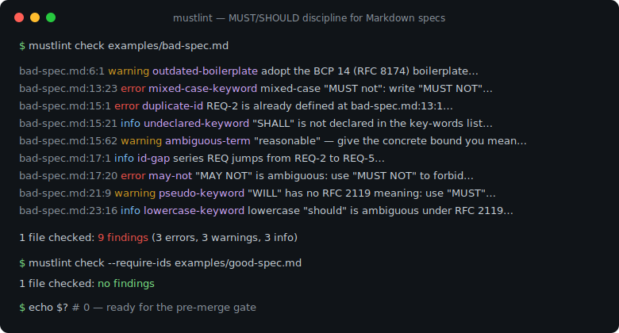
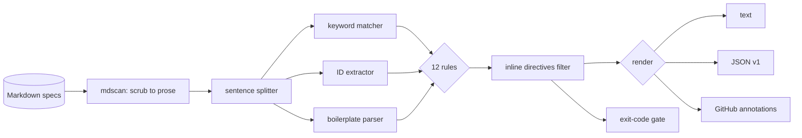

# mustlint

[English](README.md) | [中文](README.zh.md) | [日本語](README.ja.md)

[](LICENSE) [](go.mod) [](CHANGELOG.md)  [](CONTRIBUTING.md)

**mustlint：プレーン Markdown の仕様書に含まれる RFC 2119 要求語をチェックする、オープンソースのゼロ依存 linter——キーワード誤用・要求 ID・重複・曖昧表現を検出し、すべての指摘に正確な行:列を付ける。**



```bash
git clone https://github.com/JaydenCJ/mustlint && cd mustlint
go build -o mustlint ./cmd/mustlint    # single static binary, stdlib only
```

> プレリリース：v0.1.0 はまだどのパッケージレジストリにも公開していません。上記の手順でソースからビルドしてください（Go ≥1.22）。

## なぜ mustlint？

仕様駆動開発が戻ってきました。AI プロトコルのドラフト、社内 RFC、設計ドキュメントはみな MUST/SHOULD/MAY で適合実装の振る舞いを定めますが、どれも RFC XML では書かれていません。IETF 自身のツール群（idnits、xml2rfc エコシステム）はまさにこの規律を検査しますが、対象は Internet-Draft の XML/テキスト形式だけで、チームが実際に書く Markdown 仕様書はまったくチェックされません。汎用の文章 linter は単語を grep できても、`MUST not` はバグで `must not` は問題ない場合があること、`MAY NOT` に相反する二つの読みがあること、RFC 8174 なしで RFC 2119 だけを引く仕様では小文字の "should" がすべて規範扱いになってしまうこと、`REQ-7` が二つのファイルで二重定義されるとトレーサビリティ行列が壊れることを知りません。mustlint は知っています。Markdown を解析し（コードブロック・インラインコード・コメント・URL は不可視）、実際の文に分割し、すべての BCP 14 キーワードを大小・複合形で分類し、要求 ID をコーパス全体で追跡し、各違反にルール名・修正案・正確な位置を添えて報告——そして非ゼロで終了し、マージゲートが「ノー」と言えるようにします。

| | mustlint | idnits / rfclint | Vale（カスタム style） | markdownlint |
|---|---|---|---|---|
| プレーン Markdown 仕様書を直接検査 | ✅ | ❌ RFC XML/テキストのみ | ✅ | ✅ 体裁のみ |
| RFC 2119/8174 ルールを標準搭載 | ✅ 12 ルール | ✅ | ❌ 正規表現を自作 | ❌ |
| 大小・複合語を認識（`MUST not`、`MAY NOT`） | ✅ | 部分的 | ❌ 正規表現どまり | ❌ |
| 要求 ID の規律（重複・欠番・網羅） | ✅ ファイル横断 | ❌ | ❌ | ❌ |
| 重複要求の検出 | ✅ コーパス全体 | ❌ | ❌ | ❌ |
| コードブロック / インラインコード / URL を無視 | ✅ | 対象外 | ✅ | ✅ |
| 終了コード + GitHub アノテーションの CI ゲート | ✅ | ❌ レポートのみ | ✅ | ✅ |
| ランタイム依存 | 0 | Python + 依存 | Go バイナリ + styles | Node + 依存 |

<sub>2026-07-12 確認：mustlint は Go 標準ライブラリのみを import。idnits 2.17 は Python が必要で、Vale は RFC 2119 style を同梱していません。</sub>

## 機能

- **単語ではなく十一のキーワードを理解** —— 複合語を認識するマッチングが `MUST not`（大小混在、error）、`MAY NOT`（未定義かつ自己矛盾、error）、疑似規範語の `WILL`/`CANNOT`/`MANDATORY`、行折り返しで分断された複合キーワードを捕捉。
- **ボイラープレートの誠実さ** —— 大文字キーワードを使いながら BCP 14 宣言がない、RFC 2119 のみの引用で小文字語が暗黙に規範化される（RFC 8174）、宣言リストにないキーワードの使用（idnits 流）を指摘。
- **要求 ID の規律** —— 重複 ID はコーパス全体で error、採番の欠落も表面化。`--require-ids` はすべての規範文に ID を要求し、見出し継承（`### REQ-7 …`）にも対応。
- **効く場所だけ曖昧さを追う** —— 約 30 の曖昧修飾語（"as appropriate"、"best effort"、"in a timely manner"、"and/or"）を規範文の中に限って指摘し、それぞれに具体的な修正ヒントを付与。説明的な文章は自由にぼかしてよい。
- **散文だけを解析、位置は正確** —— フェンス/インデントコード、インラインコード、HTML コメント、リンク先、URL、テーブル、front matter をバイト単位で除去。コード例の中身がルールを発火させることはなく、指摘は必ず実際の行:列に着地。
- **三つの出力、一つの終了コード** —— 人間向けテキスト、安定 JSON（`schema_version: 1`）、GitHub ネイティブのアノテーション。`--fail-on error|warning|info|never` がビルドを壊す基準を決める。
- **ゼロ依存・完全オフライン** —— Go 標準ライブラリのみ。指定されたファイルを読み、stdout に書くだけで、ネットワークには一切触れない。テレメトリなし。

## クイックスタート

```bash
./mustlint check examples/bad-spec.md
```

実際にキャプチャした出力：

```text
examples/bad-spec.md:6:1  warning  outdated-boilerplate   boilerplate cites RFC 2119 without the RFC 8174 "all capitals" clause, yet 1 lowercase keyword instance exists (first: examples/bad-spec.md:23:16): adopt the BCP 14 boilerplate so only capitalized keywords are normative
examples/bad-spec.md:13:23  error    mixed-case-keyword     mixed-case "MUST not": write "MUST NOT" with both words in capitals so the compound keyword is unambiguous
examples/bad-spec.md:15:1  error    duplicate-id           requirement ID REQ-2 is already defined at examples/bad-spec.md:13:1: give each requirement a unique ID
examples/bad-spec.md:15:21  info     undeclared-keyword     "SHALL" is used but the key-words boilerplate does not declare it: add it to the quoted list (or use a declared keyword)
examples/bad-spec.md:15:62  warning  ambiguous-term         "reasonable" leaves this requirement open to interpretation: give the concrete bound you mean
examples/bad-spec.md:17:1  info     id-gap                 series REQ jumps from REQ-2 to REQ-5 (REQ-3, REQ-4 missing): if requirements were removed, retire their IDs explicitly rather than leaving silent holes
examples/bad-spec.md:17:20  error    may-not                "MAY NOT" is not an RFC 2119 keyword and is ambiguous (forbidden, or allowed to skip?): use "MUST NOT" to forbid, or rephrase as "MAY omit"
examples/bad-spec.md:21:9  warning  pseudo-keyword         "WILL" reads as normative but has no RFC 2119 meaning: use "MUST" (or "SHALL"), or write it in lowercase for plain prose
examples/bad-spec.md:23:16  info     lowercase-keyword      lowercase "should" is ambiguous under a plain RFC 2119 boilerplate: capitalize it if it states a requirement, or reword it (e.g. "needs to") if it does not

1 file checked: 9 findings (3 errors, 3 warnings, 3 info)
```

修正済みの対になる仕様は厳格モードでも通過——`stats` は仕様が実際に何を約束しているかを見せます（実出力）：

```text
$ ./mustlint check --require-ids examples/good-spec.md
1 file checked: no findings

$ ./mustlint stats examples/good-spec.md
file                     MUST  MUST NOT  SHOULD  SHOULD NOT    MAY  other   reqs   ids
examples/good-spec.md       4         2       1           0      0      0      6     6
```

## ルール

4 グループ・全 12 ルール——例と修正指針つきの完全リファレンスは [docs/rules.md](docs/rules.md) を参照。

| ルール | 重大度 | 検出内容 |
|---|---|---|
| `missing-boilerplate` | warning | RFC 2119 キーワードを使いながら宣言がない |
| `outdated-boilerplate` | warning | RFC 2119 のみの宣言のまま小文字キーワードが存在 |
| `undeclared-keyword` | info | 使用済みだが key words 宣言リストにないキーワード |
| `lowercase-keyword` | info | 素の RFC 2119 下で曖昧な小文字 must/shall/should |
| `mixed-case-keyword` | error | `MUST not`、`must NOT`——複合語の大小不一致 |
| `may-not` | error | `MAY NOT`：禁止か、省略可か？どちらの読みも未定義 |
| `pseudo-keyword` | warning | 全大文字の `WILL`、`MIGHT`、`CANNOT`、`MANDATORY` など |
| `missing-id` | warning | 要求 ID のない規範文（`--require-ids`） |
| `duplicate-id` | error | 同じ要求 ID がコーパス内のどこかで二重定義 |
| `id-gap` | info | ID 系列内の採番の穴（REQ-2 → REQ-5） |
| `duplicate-requirement` | warning | 正規化後に同一となる二つの規範文 |
| `ambiguous-term` | warning | 規範文中の曖昧な修飾語 |

レンダリング時に見えない HTML コメントでその場で抑制できます：`<!-- mustlint-disable-next-line may-not -->`、または `<!-- mustlint-disable … -->` / `<!-- mustlint-enable -->` で範囲を囲む。コード内に示されたディレクティブはドキュメントとして扱われ、発効しません。

## CLI リファレンス

`mustlint [check|stats|rules|version] [flags] <file|dir>...` —— 既定のサブコマンドは `check`。終了コード：0 合格、1 `--fail-on` 以上の指摘あり、2 使い方エラー、3 実行時エラー。

| フラグ | 既定値 | 効果 |
|---|---|---|
| `--format` | `text` | `text`、`json`、`github`（`stats` は `text`/`json`） |
| `--fail-on` | `warning` | 終了コード 1 とする重大度：`error`、`warning`、`info`、`never` |
| `--disable` | — | ルールを無効化（複数指定可） |
| `--require-ids` | off | すべての規範文に要求 ID を必須化 |
| `--id-pattern` | `REQ-1` 形式 | 要求 ID の正規表現を指定（引用ストップリストを回避） |
| `--quiet` | off | 指摘のみ出力し、サマリ行を省略 |

ディレクトリは再帰的に走査して `.md`/`.markdown` を収集（隠しディレクトリは除外）、ソート済みで出力は決定的——`duplicate-id` などのコーパス規則は全ファイルを一度に見ます。

## 検証

このリポジトリは CI を同梱しません。上記の主張はすべてローカル実行で検証しています：

```bash
go test ./...            # 90 deterministic tests, offline, < 5 s
bash scripts/smoke.sh    # end-to-end CLI check, prints SMOKE OK
```

## アーキテクチャ



## ロードマップ

- [x] v0.1.0 —— 散文認識の Markdown スキャナ、大小/複合語キーワード解析、12 ルール、要求 ID 追跡、インライン抑制、text/JSON/GitHub 出力、90 テスト + smoke スクリプト
- [ ] code-scanning 連携向け SARIF 出力
- [ ] 機械的な書き換えを行う `--fix`（`MUST not` → `MUST NOT`）
- [ ] トレーサビリティ行列向けの要求エクスポート（`mustlint reqs --format csv`）
- [ ] ISO/IEC 指令スタイル（"shall" 基準）文書向けキーワードプロファイル
- [ ] リポジトリ単位でルールを設定するプロジェクト設定ファイル（`.mustlint.toml`）

全リストは [open issues](https://github.com/JaydenCJ/mustlint/issues) を参照。

## コントリビュート

Issue・ディスカッション・PR を歓迎します——ローカルの作業手順（フォーマット、vet、テスト、`SMOKE OK`）は [CONTRIBUTING.md](CONTRIBUTING.md) を参照。入門タスクは [good first issue](https://github.com/JaydenCJ/mustlint/issues?q=is%3Aissue+is%3Aopen+label%3A%22good+first+issue%22) ラベル、設計の議論は [Discussions](https://github.com/JaydenCJ/mustlint/discussions) へ。

## ライセンス

[MIT](LICENSE)
