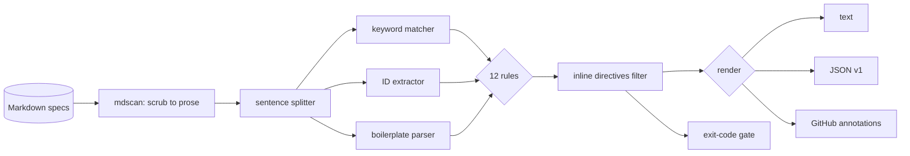

# mustlint

[English](README.md) | [中文](README.zh.md) | [日本語](README.ja.md)

[](LICENSE) [](go.mod) [](CHANGELOG.md)  [](CONTRIBUTING.md)

**mustlint：an open-source, zero-dependency linter for RFC 2119 requirement language in plain-Markdown specs — keyword misuse, requirement IDs, duplicates, and ambiguity, with an exact line:column for every finding.**


```bash
git clone https://github.com/JaydenCJ/mustlint && cd mustlint
go build -o mustlint ./cmd/mustlint    # single static binary, stdlib only
```

> Pre-release: v0.1.0 is not tagged on a package registry yet; build from source as above (any Go ≥1.22).

## Why mustlint?

Spec-driven development is back: AI protocol drafts, internal RFCs, and design docs all lean on MUST/SHOULD/MAY to say what conforming implementations do — and none of them are written in RFC XML. The IETF's own tooling (idnits, the xml2rfc ecosystem) checks exactly this discipline, but only for Internet-Draft XML/text formats, so the Markdown specs teams actually write get no checks at all. General prose linters can grep for words, but they don't know that `MUST not` is a bug while `must not` may be fine, that `MAY NOT` has two contradictory readings, that a spec citing RFC 2119 without RFC 8174 silently makes every lowercase "should" normative, or that `REQ-7` being defined twice across two files will corrupt your traceability matrix. mustlint knows. It parses the Markdown (code blocks, inline code, comments, and URLs are invisible), splits real sentences, classifies every BCP 14 keyword by case and compound, tracks requirement IDs corpus-wide, and reports each violation with a rule name, a fix suggestion, and an exact position — then exits non-zero so your merge gate can say no.

| | mustlint | idnits / rfclint | Vale (custom style) | markdownlint |
|---|---|---|---|---|
| Lints plain Markdown specs | ✅ | ❌ RFC XML/text drafts | ✅ | ✅ style only |
| RFC 2119/8174 rules built in | ✅ 12 rules | ✅ | ❌ write your own regex | ❌ |
| Case/compound-aware keywords (`MUST not`, `MAY NOT`) | ✅ | partial | ❌ regex-level | ❌ |
| Requirement-ID discipline (duplicates, gaps, coverage) | ✅ cross-file | ❌ | ❌ | ❌ |
| Duplicate-requirement detection | ✅ corpus-wide | ❌ | ❌ | ❌ |
| Ignores code blocks / inline code / URLs | ✅ | n/a | ✅ | ✅ |
| CI gate with exit codes + GitHub annotations | ✅ | ❌ report only | ✅ | ✅ |
| Runtime dependencies | 0 | Python + deps | Go binary + styles | Node + deps |

<sub>Checked 2026-07-12: mustlint imports the Go standard library only; idnits 2.17 requires Python, and Vale ships no RFC 2119 style out of the box.</sub>

## Features

- **Knows the eleven keywords, not just the words** — compound-aware matching catches `MUST not` (mixed case, error), `MAY NOT` (undefined and self-contradictory, error), pseudo-normative `WILL`/`CANNOT`/`MANDATORY`, and compounds split across wrapped lines.
- **Boilerplate honesty** — flags uppercase keywords with no BCP 14 declaration, RFC 2119-only boilerplate that silently makes lowercase words normative (RFC 8174), and keywords used but missing from the declared list, idnits-style.
- **Requirement-ID discipline** — duplicate IDs are errors across the whole corpus, numbering gaps are surfaced, and `--require-ids` demands an ID on every normative statement, with section-heading inheritance (`### REQ-7 …`) honored.
- **Ambiguity hunting where it matters** — ~30 vague qualifiers ("as appropriate", "best effort", "in a timely manner", "and/or") are flagged only inside normative sentences, each with a tailored fix hint; descriptive prose may hedge freely.
- **Prose-only analysis, exact positions** — fenced/indented code, inline code, HTML comments, link targets, URLs, tables, and front matter are scrubbed byte-for-byte, so nothing in a code sample ever fires a rule and every finding lands on the real line:column.
- **Three outputs, one exit code** — human text, stable JSON (`schema_version: 1`), and native GitHub annotations; `--fail-on error|warning|info|never` decides what breaks the build.
- **Zero dependencies, fully offline** — Go standard library only; reads the files you name, writes to stdout, and never talks to a network. No telemetry.

## Quickstart

```bash
./mustlint check examples/bad-spec.md
```

Real captured output:

```text
examples/bad-spec.md:6:1  warning  outdated-boilerplate   boilerplate cites RFC 2119 without the RFC 8174 "all capitals" clause, yet 1 lowercase keyword instance exists (first: examples/bad-spec.md:23:16): adopt the BCP 14 boilerplate so only capitalized keywords are normative
examples/bad-spec.md:13:23  error    mixed-case-keyword     mixed-case "MUST not": write "MUST NOT" with both words in capitals so the compound keyword is unambiguous
examples/bad-spec.md:15:1  error    duplicate-id           requirement ID REQ-2 is already defined at examples/bad-spec.md:13:1: give each requirement a unique ID
examples/bad-spec.md:15:21  info     undeclared-keyword     "SHALL" is used but the key-words boilerplate does not declare it: add it to the quoted list (or use a declared keyword)
examples/bad-spec.md:15:62  warning  ambiguous-term         "reasonable" leaves this requirement open to interpretation: give the concrete bound you mean
examples/bad-spec.md:17:1  info     id-gap                 series REQ jumps from REQ-2 to REQ-5 (REQ-3, REQ-4 missing): if requirements were removed, retire their IDs explicitly rather than leaving silent holes
examples/bad-spec.md:17:20  error    may-not                "MAY NOT" is not an RFC 2119 keyword and is ambiguous (forbidden, or allowed to skip?): use "MUST NOT" to forbid, or rephrase as "MAY omit"
examples/bad-spec.md:21:9  warning  pseudo-keyword         "WILL" reads as normative but has no RFC 2119 meaning: use "MUST" (or "SHALL"), or write it in lowercase for plain prose
examples/bad-spec.md:23:16  info     lowercase-keyword      lowercase "should" is ambiguous under a plain RFC 2119 boilerplate: capitalize it if it states a requirement, or reword it (e.g. "needs to") if it does not

1 file checked: 9 findings (3 errors, 3 warnings, 3 info)
```

The cleaned-up counterpart passes, even in strict mode — and `stats` shows what a spec actually commits to (real output):

```text
$ ./mustlint check --require-ids examples/good-spec.md
1 file checked: no findings

$ ./mustlint stats examples/good-spec.md
file                     MUST  MUST NOT  SHOULD  SHOULD NOT    MAY  other   reqs   ids
examples/good-spec.md       4         2       1           0      0      0      6     6
```

## Rules

Twelve rules in four groups — full reference with examples and fix guidance in [docs/rules.md](docs/rules.md).

| Rule | Severity | Catches |
|---|---|---|
| `missing-boilerplate` | warning | RFC 2119 keywords used but never declared |
| `outdated-boilerplate` | warning | RFC 2119-only boilerplate while lowercase keywords exist |
| `undeclared-keyword` | info | keyword used but absent from the declared key-words list |
| `lowercase-keyword` | info | ambiguous lowercase must/shall/should under plain RFC 2119 |
| `mixed-case-keyword` | error | `MUST not`, `must NOT` — compound with inconsistent capitals |
| `may-not` | error | `MAY NOT`: forbidden, or allowed to skip? Undefined either way |
| `pseudo-keyword` | warning | all-caps `WILL`, `MIGHT`, `CANNOT`, `MANDATORY`, … |
| `missing-id` | warning | normative statement without a requirement ID (`--require-ids`) |
| `duplicate-id` | error | same requirement ID defined twice, anywhere in the corpus |
| `id-gap` | info | numbering holes inside an ID series (REQ-2 → REQ-5) |
| `duplicate-requirement` | warning | two normative statements identical after normalization |
| `ambiguous-term` | warning | vague qualifiers inside normative sentences |

Suppress any finding inline with HTML comments that are invisible when rendered: `<!-- mustlint-disable-next-line may-not -->`, or `<!-- mustlint-disable … -->` / `<!-- mustlint-enable -->` around a region. Directives inside code spans are documentation and stay inert.

## CLI reference

`mustlint [check|stats|rules|version] [flags] <file|dir>...` — `check` is the default. Exit codes: 0 ok, 1 findings at/above `--fail-on`, 2 usage error, 3 runtime error.

| Flag | Default | Effect |
|---|---|---|
| `--format` | `text` | `text`, `json`, or `github` (`stats`: `text`/`json`) |
| `--fail-on` | `warning` | severity that exits 1: `error`, `warning`, `info`, `never` |
| `--disable` | — | switch a rule off (repeatable) |
| `--require-ids` | off | every normative statement needs a requirement ID |
| `--id-pattern` | `REQ-1` style | custom requirement-ID regexp (bypasses the citation stoplist) |
| `--quiet` | off | findings only, no summary line |

Directories are walked recursively for `.md`/`.markdown` files (hidden directories skipped), sorted for deterministic output — corpus rules like `duplicate-id` see all files at once.

## Verification

This repository ships no CI; every claim above is verified by local runs:

```bash
go test ./...            # 90 deterministic tests, offline, < 5 s
bash scripts/smoke.sh    # end-to-end CLI check, prints SMOKE OK
```

## Architecture



## Roadmap

- [x] v0.1.0 — prose-aware Markdown scanner, case/compound keyword analysis, 12 rules, requirement-ID tracking, inline suppression, text/JSON/GitHub output, 90 tests + smoke script
- [ ] SARIF output for code-scanning integrations
- [ ] `--fix` for mechanical rewrites (`MUST not` → `MUST NOT`)
- [ ] Requirements export (`mustlint reqs --format csv`) for traceability matrices
- [ ] Keyword profile for ISO/IEC-directive style ("shall"-based) documents
- [ ] Project config file (`.mustlint.toml`) for per-repo rule settings

See the [open issues](https://github.com/JaydenCJ/mustlint/issues) for the full list.

## Contributing

Issues, discussions and pull requests are welcome — see [CONTRIBUTING.md](CONTRIBUTING.md) for the local workflow (format, vet, tests, `SMOKE OK`). Good entry points are labelled [good first issue](https://github.com/JaydenCJ/mustlint/issues?q=is%3Aissue+is%3Aopen+label%3A%22good+first+issue%22), and design questions live in [Discussions](https://github.com/JaydenCJ/mustlint/discussions).

## License

[MIT](LICENSE)
