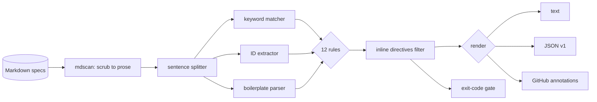

# mustlint

[English](README.md) | [中文](README.zh.md) | [日本語](README.ja.md)

[](LICENSE) [](go.mod) [](CHANGELOG.md)  [](CONTRIBUTING.md)

**mustlint：开源、零依赖的 RFC 2119 规范语言 linter，面向纯 Markdown 规格文档——检查关键词误用、需求 ID、重复与含糊表述，每条发现都给出精确的行:列位置。**


```bash
git clone https://github.com/JaydenCJ/mustlint && cd mustlint
go build -o mustlint ./cmd/mustlint    # single static binary, stdlib only
```

> 预发布：v0.1.0 尚未发布到任何包仓库；请按上述方式从源码构建（任意 Go ≥1.22）。

## 为什么选 mustlint？

规格驱动开发正在回归：AI 协议草案、内部 RFC、设计文档都依赖 MUST/SHOULD/MAY 来约定合规实现的行为——而它们没有一个是用 RFC XML 写的。IETF 自家的工具（idnits、xml2rfc 生态）检查的正是这种纪律，但只支持 Internet-Draft 的 XML/文本格式，团队实际书写的 Markdown 规格完全没有检查。通用文本 linter 能 grep 单词，却不知道 `MUST not` 是 bug 而 `must not` 可能没问题，不知道 `MAY NOT` 有两种互相矛盾的读法，不知道只引用 RFC 2119 而不引用 RFC 8174 的规格会让每个小写 "should" 悄悄变成规范性表述，也不知道 `REQ-7` 在两个文件里被定义两次会毁掉你的追踪矩阵。mustlint 知道。它解析 Markdown（代码块、行内代码、注释和 URL 全部不可见），切分真正的句子，按大小写和复合形式对每个 BCP 14 关键词分类，在整个语料范围内追踪需求 ID，并为每个违规给出规则名、修复建议和精确位置——然后以非零码退出，让合并门禁能说不。

| | mustlint | idnits / rfclint | Vale（自定义 style） | markdownlint |
|---|---|---|---|---|
| 直接检查纯 Markdown 规格 | ✅ | ❌ 仅 RFC XML/文本草案 | ✅ | ✅ 仅样式 |
| 内置 RFC 2119/8174 规则 | ✅ 12 条 | ✅ | ❌ 需自写正则 | ❌ |
| 感知大小写/复合词（`MUST not`、`MAY NOT`） | ✅ | 部分 | ❌ 停留在正则层面 | ❌ |
| 需求 ID 纪律（重复、断号、覆盖率） | ✅ 跨文件 | ❌ | ❌ | ❌ |
| 重复需求检测 | ✅ 全语料 | ❌ | ❌ | ❌ |
| 忽略代码块 / 行内代码 / URL | ✅ | 不适用 | ✅ | ✅ |
| CI 门禁（退出码 + GitHub 注解） | ✅ | ❌ 仅报告 | ✅ | ✅ |
| 运行时依赖 | 0 | Python + 依赖 | Go 二进制 + styles | Node + 依赖 |

<sub>核对于 2026-07-12：mustlint 仅导入 Go 标准库；idnits 2.17 需要 Python，Vale 官方未附带 RFC 2119 style。</sub>

## 功能特性

- **认识全部十一个关键词，而不只是单词** —— 复合词感知匹配能抓出 `MUST not`（大小写混用，error）、`MAY NOT`（未定义且自相矛盾，error）、伪规范性的 `WILL`/`CANNOT`/`MANDATORY`，以及跨换行折断的复合关键词。
- **样板声明诚实性** —— 标记使用了大写关键词却没有 BCP 14 声明、仅引用 RFC 2119 从而让小写词悄悄具备规范性（RFC 8174）、以及 idnits 风格的"已使用但未在声明列表中"的关键词。
- **需求 ID 纪律** —— 重复 ID 在整个语料范围内报 error，编号断档会被指出；`--require-ids` 要求每条规范性陈述都有 ID，并支持章节标题继承（`### REQ-7 …`）。
- **只在要紧处捕捉含糊表述** —— 约 30 个含糊限定语（"as appropriate"、"best effort"、"in a timely manner"、"and/or"）只在规范性句子中被标记，每条都附带针对性修复提示；描述性文字可以随意打太极。
- **纯文本层面分析，位置精确** —— 围栏/缩进代码、行内代码、HTML 注释、链接目标、URL、表格、front matter 均按字节抹除，代码示例里的内容绝不会触发规则，每条发现都落在真实的行:列上。
- **三种输出，一个退出码** —— 人类可读文本、稳定 JSON（`schema_version: 1`）、原生 GitHub 注解；`--fail-on error|warning|info|never` 决定什么会打断构建。
- **零依赖、完全离线** —— 仅 Go 标准库；只读取你指定的文件、写到 stdout，绝不联网。无遥测。

## 快速上手

```bash
./mustlint check examples/bad-spec.md
```

真实捕获的输出：

```text
examples/bad-spec.md:6:1  warning  outdated-boilerplate   boilerplate cites RFC 2119 without the RFC 8174 "all capitals" clause, yet 1 lowercase keyword instance exists (first: examples/bad-spec.md:23:16): adopt the BCP 14 boilerplate so only capitalized keywords are normative
examples/bad-spec.md:13:23  error    mixed-case-keyword     mixed-case "MUST not": write "MUST NOT" with both words in capitals so the compound keyword is unambiguous
examples/bad-spec.md:15:1  error    duplicate-id           requirement ID REQ-2 is already defined at examples/bad-spec.md:13:1: give each requirement a unique ID
examples/bad-spec.md:15:21  info     undeclared-keyword     "SHALL" is used but the key-words boilerplate does not declare it: add it to the quoted list (or use a declared keyword)
examples/bad-spec.md:15:62  warning  ambiguous-term         "reasonable" leaves this requirement open to interpretation: give the concrete bound you mean
examples/bad-spec.md:17:1  info     id-gap                 series REQ jumps from REQ-2 to REQ-5 (REQ-3, REQ-4 missing): if requirements were removed, retire their IDs explicitly rather than leaving silent holes
examples/bad-spec.md:17:20  error    may-not                "MAY NOT" is not an RFC 2119 keyword and is ambiguous (forbidden, or allowed to skip?): use "MUST NOT" to forbid, or rephrase as "MAY omit"
examples/bad-spec.md:21:9  warning  pseudo-keyword         "WILL" reads as normative but has no RFC 2119 meaning: use "MUST" (or "SHALL"), or write it in lowercase for plain prose
examples/bad-spec.md:23:16  info     lowercase-keyword      lowercase "should" is ambiguous under a plain RFC 2119 boilerplate: capitalize it if it states a requirement, or reword it (e.g. "needs to") if it does not

1 file checked: 9 findings (3 errors, 3 warnings, 3 info)
```

修好的对照版即使在严格模式下也能通过——`stats` 则展示一份规格实际承诺了什么（真实输出）：

```text
$ ./mustlint check --require-ids examples/good-spec.md
1 file checked: no findings

$ ./mustlint stats examples/good-spec.md
file                     MUST  MUST NOT  SHOULD  SHOULD NOT    MAY  other   reqs   ids
examples/good-spec.md       4         2       1           0      0      0      6     6
```

## 规则

四组共十二条规则——含示例与修复指引的完整参考见 [docs/rules.md](docs/rules.md)。

| 规则 | 严重级 | 捕捉内容 |
|---|---|---|
| `missing-boilerplate` | warning | 使用了 RFC 2119 关键词却从未声明 |
| `outdated-boilerplate` | warning | 仅 RFC 2119 的样板声明，同时存在小写关键词 |
| `undeclared-keyword` | info | 关键词已使用但不在声明的 key words 列表中 |
| `lowercase-keyword` | info | 纯 RFC 2119 下含糊的小写 must/shall/should |
| `mixed-case-keyword` | error | `MUST not`、`must NOT`——复合词大小写不一致 |
| `may-not` | error | `MAY NOT`：是禁止还是允许跳过？两种读法都无定义 |
| `pseudo-keyword` | warning | 全大写的 `WILL`、`MIGHT`、`CANNOT`、`MANDATORY` 等 |
| `missing-id` | warning | 规范性陈述缺少需求 ID（`--require-ids`） |
| `duplicate-id` | error | 同一需求 ID 在语料中任意位置被定义两次 |
| `id-gap` | info | ID 序列中的编号断档（REQ-2 → REQ-5） |
| `duplicate-requirement` | warning | 归一化后完全相同的两条规范性陈述 |
| `ambiguous-term` | warning | 规范性句子中的含糊限定语 |

可用渲染后不可见的 HTML 注释就地压制任何发现：`<!-- mustlint-disable-next-line may-not -->`，或用 `<!-- mustlint-disable … -->` / `<!-- mustlint-enable -->` 包住一段区域。代码片段里展示的指令只是文档，不会生效。

## CLI 参考

`mustlint [check|stats|rules|version] [flags] <file|dir>...` —— 默认子命令为 `check`。退出码：0 通过，1 存在达到 `--fail-on` 级别的发现，2 用法错误，3 运行时错误。

| 标志 | 默认值 | 作用 |
|---|---|---|
| `--format` | `text` | `text`、`json` 或 `github`（`stats`：`text`/`json`） |
| `--fail-on` | `warning` | 触发退出码 1 的严重级：`error`、`warning`、`info`、`never` |
| `--disable` | — | 关闭某条规则（可重复） |
| `--require-ids` | 关 | 每条规范性陈述都必须有需求 ID |
| `--id-pattern` | `REQ-1` 风格 | 自定义需求 ID 正则（绕过引文排除表） |
| `--quiet` | 关 | 仅输出发现，不打印汇总行 |

目录会被递归遍历以收集 `.md`/`.markdown` 文件（跳过隐藏目录），排序后输出确定——`duplicate-id` 等语料级规则一次看到所有文件。

## 验证

本仓库不附带任何 CI；以上所有结论均由本地运行验证：

```bash
go test ./...            # 90 deterministic tests, offline, < 5 s
bash scripts/smoke.sh    # end-to-end CLI check, prints SMOKE OK
```

## 架构



## 路线图

- [x] v0.1.0 —— 感知文本结构的 Markdown 扫描器、大小写/复合词关键词分析、12 条规则、需求 ID 追踪、就地压制、text/JSON/GitHub 输出、90 个测试 + smoke 脚本
- [ ] SARIF 输出，对接 code-scanning 集成
- [ ] `--fix` 机械改写（`MUST not` → `MUST NOT`）
- [ ] 需求导出（`mustlint reqs --format csv`），用于追踪矩阵
- [ ] 面向 ISO/IEC 指令风格（以 "shall" 为准）文档的关键词 profile
- [ ] 项目级配置文件（`.mustlint.toml`），按仓库定制规则

完整列表见 [open issues](https://github.com/JaydenCJ/mustlint/issues)。

## 参与贡献

欢迎 issue、讨论与 PR——本地工作流（格式化、vet、测试、`SMOKE OK`）见 [CONTRIBUTING.md](CONTRIBUTING.md)。入门任务见 [good first issue](https://github.com/JaydenCJ/mustlint/issues?q=is%3Aissue+is%3Aopen+label%3A%22good+first+issue%22) 标签，设计讨论请移步 [Discussions](https://github.com/JaydenCJ/mustlint/discussions)。

## 许可证

[MIT](LICENSE)
